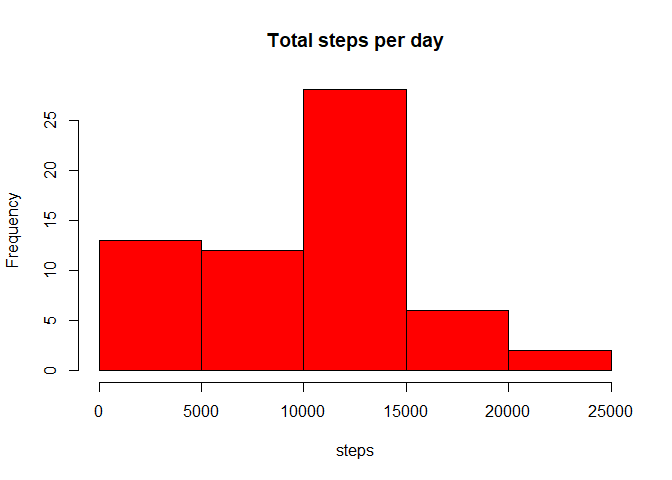
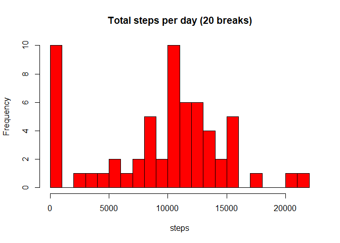
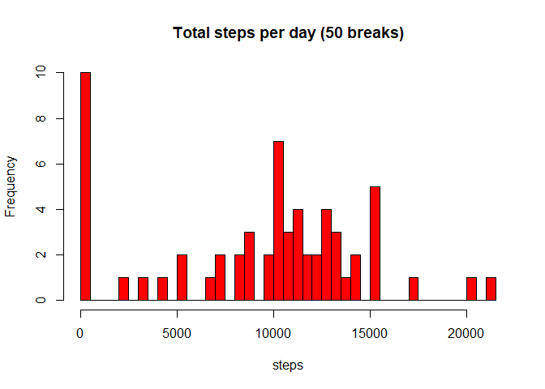
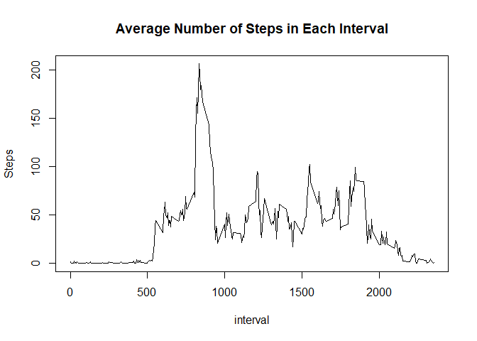
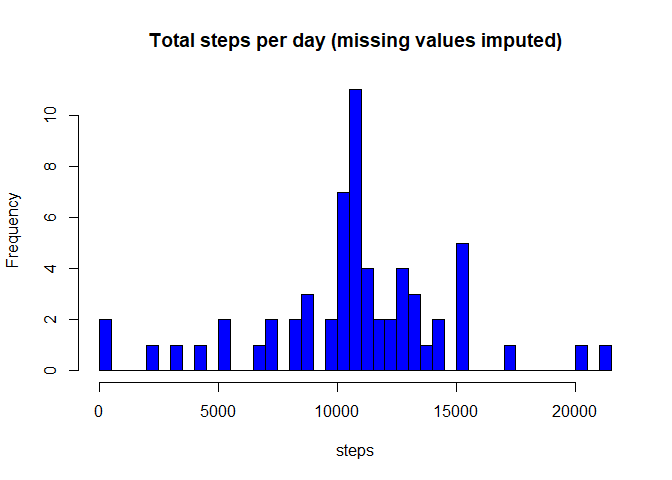
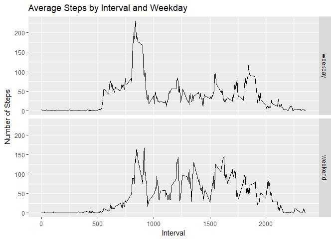

# PA1_template
Adolfo Corrales  
25 de enero de 2018  

# Reproducible Research. Course Project 1

In this document we will explain the analysis of the data set "Activity monitoring data" as proposed in the 
instructions for the Project 1 of the "Reproducible Research Course"

## Loading and preprocessing the data
First of all we have to set the working directory and then we may use "read.csv" to read the data. 

```r
setwd("~/ADOLFO/COURSERA REPRODUCIBLE RESEARCH/WEEK2 COURSE PROJECT")
data <- read.csv("activity.csv")
```
Once the data have been loaded, we can check dimension and structure of the data

```r
str(data)
```

```
## 'data.frame':	17568 obs. of  3 variables:
##  $ steps   : int  NA NA NA NA NA NA NA NA NA NA ...
##  $ date    : Factor w/ 61 levels "2012-10-01","2012-10-02",..: 1 1 1 1 1 1 1 1 1 1 ...
##  $ interval: int  0 5 10 15 20 25 30 35 40 45 ...
```

We have a data frame with 17568 observations and three variables: steps (an integer), data (a factor with the days) and interval (an integer)

## Histogram of the total number of steps taken each day
We first group the data by the variable "date"", so as to summarize information by days. We have to call the library(dplyr) to do that:

```r
library(dplyr)
```

```
## 
## Attaching package: 'dplyr'
```

```
## The following objects are masked from 'package:stats':
## 
##     filter, lag
```

```
## The following objects are masked from 'package:base':
## 
##     intersect, setdiff, setequal, union
```

```r
DataByDay <- group_by(data, date)
StepsDay <- summarize(DataByDay, steps = sum(steps, na.rm=TRUE))
```

Now we can plot the histogram to show the distribution of total daily steps. 

```r
with(StepsDay, hist(steps, col="red", main="Total steps per day"))
```

<!-- -->

Here do not see a clear pattern, maybe because the histogram does not have an appropriate number of breaks.
We now try with 20 and 50 breaks to have a clearer picture

```r
with(StepsDay, hist(steps, col="red", main="Total steps per day (20 breaks)", breaks=20))
```

<!-- -->

```r
with(StepsDay, hist(steps, col="red", main="Total steps per day (50 breaks)", breaks=50))
```

<!-- -->

The case with 50 breaks shows us a clear pattern. In mos of the days the number of steps is very low.
The distribution has another mode in near 10.000 steps in a day and another high frequency point at 
about 15.000 steps. We have to bear in mind that in these data there is a significant amount of "NA"
values.

## Mean and median of total steps
To asses the mean and median of the distribution of total steps by day, we just use the summary function

```r
summary(StepsDay$steps)
```

```
##    Min. 1st Qu.  Median    Mean 3rd Qu.    Max. 
##       0    6778   10395    9354   12811   21194
```
That gives us around 9.000 steps walked in an average day.

## What is the average daily activity pattern?
Now we are interested in knowing the activity pattern on an average day. To do that we calculate 
the average number of steps in each of the 288 5-minute intervals in which the days are split. 
As we did before, we group by the variable "interval" to calculate the mean of steps taking 
in each interval. We will plot the average to see the pattern throughout the day.


```r
DataByIntervals <- group_by(data, interval)
StepsIntervals<- summarize(DataByIntervals, StepsByInterval = mean(steps, na.rm=TRUE))
with(StepsIntervals, plot(interval, StepsByInterval, type="l", 
                          main="Average Number of Steps in Each Interval", ylab="Steps"))
```

<!-- -->

What we see from the picture is that the maximum activity takes place between 5:00 and 10:00 a.m. 
likely the time most people commutes to work.To know the exact interval for maximum activity we call
the following function


```r
StepsIntervals[which.max(StepsIntervals$StepsByInterval),]
```

```
## # A tibble: 1 x 2
##   interval StepsByInterval
##      <int>           <dbl>
## 1      835        206.1698
```

The maximum number of steps on average takes place at 8:35 a.m. to be ready for the 9 to 5 working day

# Imputing missing values
The above analysis has been made removing missing values. In fact there are quite a few of them

## Total number of NA in the dataset

```r
colSums(is.na(data))
```

```
##    steps     date interval 
##     2304        0        0
```
From the instruction above we see that all missing values are concentrated in the variable "steps"
there are 2,304 missing values, which represents a 13% of the total observations. 

## Imputing missing values
Our best option to input a missing value is to use the average number of steps of the interval
with an "NA" value. We proposed the following loop to do that. The code creates a new data base with 
missing value imputed.


```r
data2 <- data
MeanSteps<- rep(StepsIntervals$StepsByInterval, 61)
for(i in 1:length(data2$steps)){
        if (is.na(data2$steps[i])){
                data2$steps[i]<- MeanSteps[i]
        }
}       
```

# A histogram wich imputed values
To see if missing values are important, we will plot the histogram of the number of steps by day, now 
using the data base with imputed values


```r
Data2ByDay <- group_by(data2, date)
Steps2Day <- summarize(Data2ByDay, steps = sum(steps))
with(Steps2Day, hist(steps, col="blue", main="Total steps per day (missing values imputed)", breaks=50))
```

<!-- -->

Missing values have a significant impact. The mode of the distribution is no longer near zero, but close
to 10,000 steps per day. Let's now see the new mean and median


```r
summary(Steps2Day$steps)
```

```
##    Min. 1st Qu.  Median    Mean 3rd Qu.    Max. 
##      41    9819   10766   10766   12811   21194
```

The new mean in closer to 11,000 than to 9,000 steps and, due to the methodology for imputing missing values, is equal to the median

## Are there differences in activity patterns between weekdays and weekends?
To assess this question we will first create a new factor variable with two levels - "weekday" and "weekend"
The first instruction is to deal with days in English rather than in Spanish (my locale).


```r
Sys.setlocale("LC_TIME", "English") # Date in English
```

```
## [1] "English_United States.1252"
```

```r
data2$weekday <- rep("weekday", length(data2$date))
data2$weekday <- as.factor(replace(data2$weekday, weekdays(as.Date(data2$date))=="Sunday"
                       |weekdays(as.Date(data2$date))=="Saturday" , "weekend"))
```

Secondly, we will make a panel plot of the 5-minute interval and the average number of steps per interval
distinguishing between working days and weekend


```r
Data2ByIntervals <- data2 %>% group_by(interval, weekday) %>% summarize(MeanSteps=mean(steps))
library(ggplot2)
g <- ggplot(Data2ByIntervals, aes(interval, MeanSteps))
g+geom_line()+
        facet_grid(weekday~.)+
        ggtitle("Average Steps by Interval and Weekday")+
        labs(x="Interval", y="Number of Steps")
```

<!-- -->

We see a different pattern between working days and weekend. In weekdays there is a clear concentration of the maximum activity at around 9:00 a.m. while the rest of the day the activity is low. In the weekend the activity is more equally distributed across the entire day.


